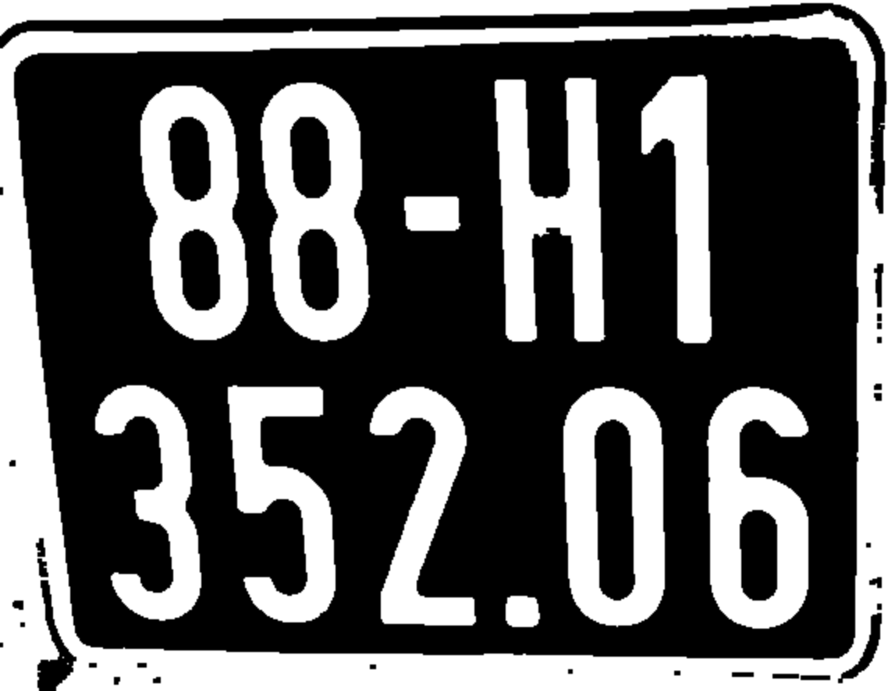
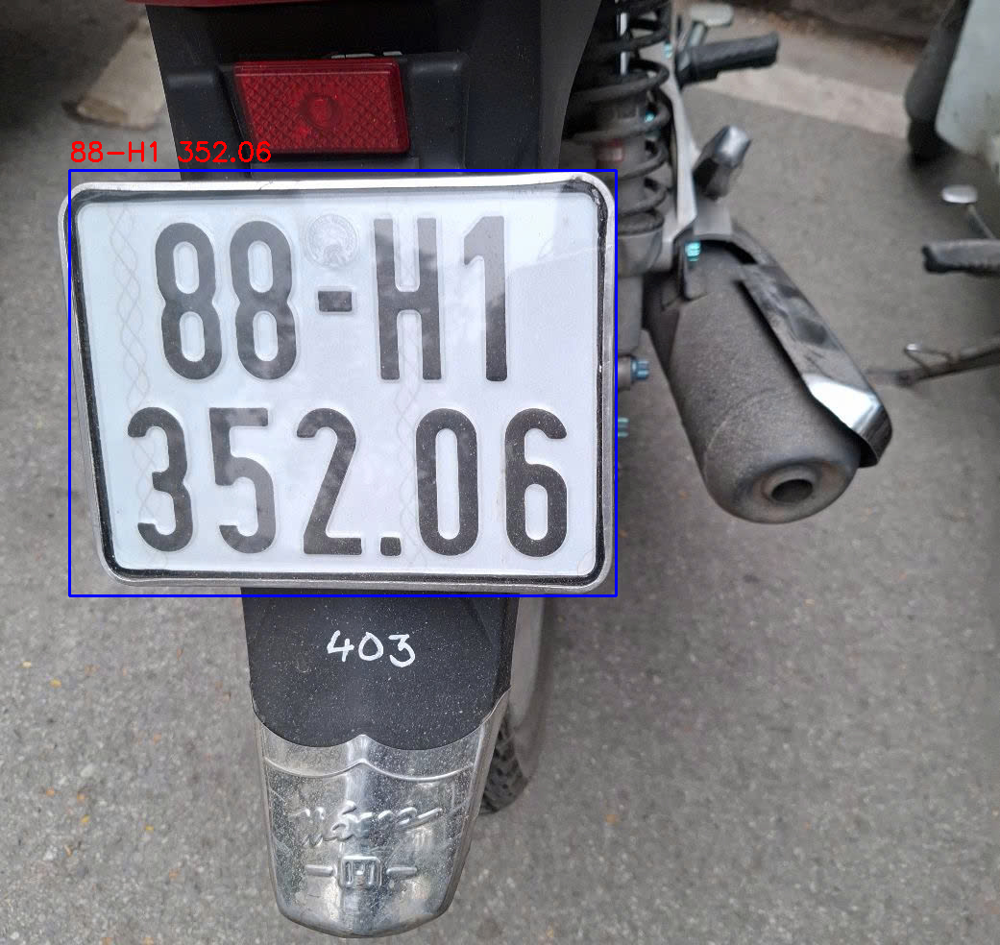

# 🏍️ Nhận Diện Biển Số Xe Máy

Sử dụng YOLOv8 và EasyOCR để phát hiện xe và đọc biển số từ ảnh.

## 🚀 Cài đặt

```bash
git clone https://github.com/NDkhoa23/hocmay3.git
cd hocmay3
pip install -r requirements.txt
```
## 🖼️ Kết Quả

Ảnh sau khi threshold biển số và nhận diện:

| Ảnh Threshold | Ảnh Kết Quả |
|---------------|--------------|
|  |  |